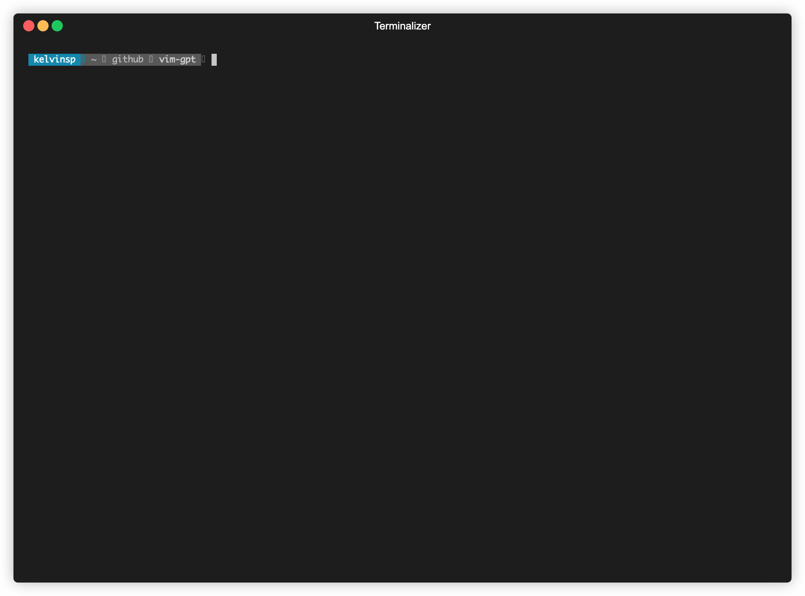

# gpt.vim

A Vim plugin for using Generative Pre-trained Transformer (GPT) from OpenAI API.



## Installation

[vim-plug](https://github.com/junegunn/vim-plug)

```
Plug 'kelvins/vim-gpt'
```

[Vundle](https://github.com/VundleVim/Vundle.vim)

```
Plugin 'kelvins/vim-gpt'
```

### Dependencies

- `curl`: to execute HTTP requests to the OpenAI API.
- `jq`: to parse JSON responses.

### Environment Variable

To use the OpenAI API you will need an API key. To get an API key, go to OpenAI platform web site ([here](https://platform.openai.com/account/api-keys)), create an account and generate the API key. Now, set the API key in the `$OPENAI_API_KEY` environment variable, for example:

```
export OPENAI_API_KEY=s4jyM5kSMbw7MG6Uqv3bw3T3B4b4F6X9pLpz36vr8eaKzXPC
```

## Usage

In Vim normal mode just type `:GPT` and an input prompt will be displayed, just type the content you want to send and hit `Enter`, for example:

```
Prompt: Write a Hello World function in Rust
```

It will open a popup window with a response preview so you can type `q` to ignore and close the popup or `w` to close the popup and copy the content to the current buffer.

### Tip

You can map a shortcut like `ctrl + g`, in your `~/.vimrc` file, to open the prompt, for example:

```
nnoremap <C-g> <ESC>:GPT<CR>
```

## Disclaimers

This plugin uses the OpenAI API, so be careful with sensitive information.

GPT doesn't always give correct answers, remember to double check any text or code generated by the AI.
